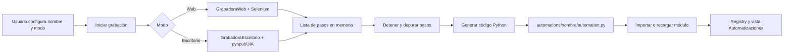
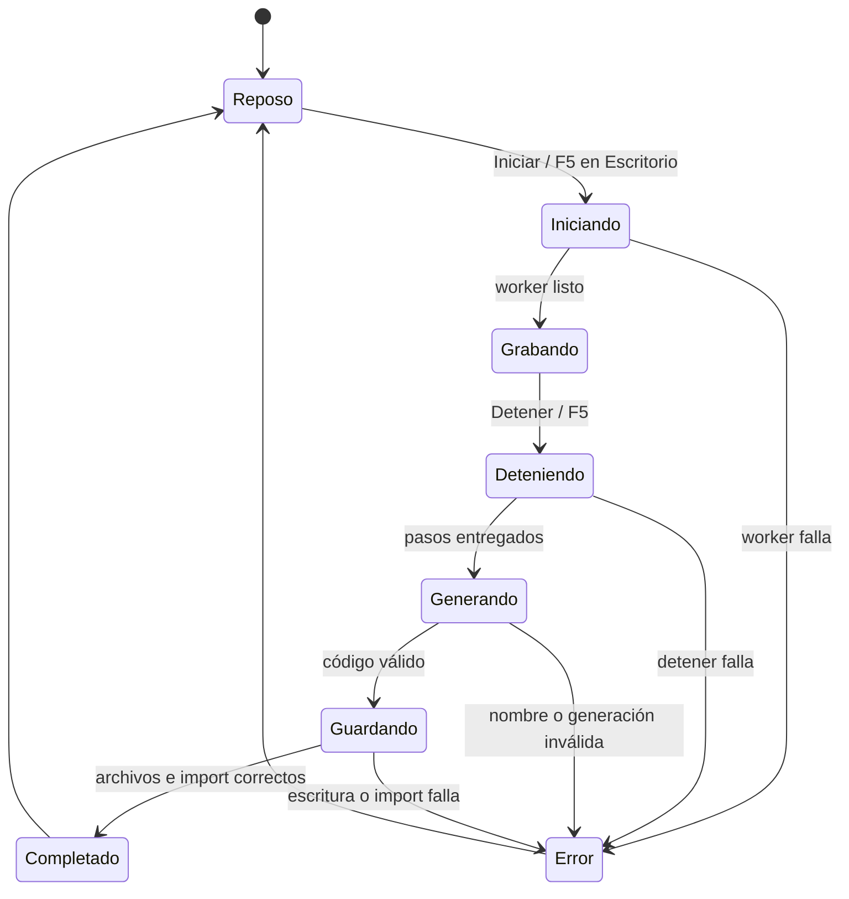

# Lógica de la Grabadora

Cómo funciona la vista **Grabadora**: el recorrido completo de un click o una
tecla hasta la línea que aparece en el `automation.py` generado, y las reglas que
deciden qué se graba y qué no.

Lo que **no** es este documento: una guía de uso. Para eso está
[Escribir automatizaciones § La grabadora](escribir-automatizaciones.md#la-grabadora).
Aquí se explica el porqué de las decisiones, que es la parte que no se puede
reconstruir leyendo el código.

## Cómo leer este documento

1. **Componentes** y **Flujo general** dan el mapa: qué pieza hace qué.
2. **Modo Web** y **Modo Escritorio** son independientes entre sí — lee solo el
   que te interese.
3. **Limitaciones conocidas** reúne todo lo que hoy no funciona o funciona a
   medias, en un solo lugar en vez de repartido por el texto.
4. **Historial de validación** es el registro fechado de qué se comprobó y
   cuándo. Es historia, no especificación.

## Componentes involucrados

| Componente | Responsabilidad |
|---|---|
| `app/windows/recorder_view.py` | Estado de la UI, workers, inicio/detención, generación y guardado. |
| `engine/actions/recorder.py` | Grabación Web, listener JavaScript, sondeo y generación de código web. |
| `engine/actions/desktop_recorder.py` | Hooks globales de mouse/teclado, UI Automation y generación de código de escritorio. |
| `engine/actions/web.py` | Apertura y operación del navegador con Selenium, incluidas las pestañas. |
| `engine/actions/desktop.py` | Reproducción de las acciones de escritorio generadas. |
| `engine/registry.py` | Registro en caliente de la automatización creada. |

## Flujo general



La lista de pasos solo vive en memoria durante la grabación. No se escribe una
acción a disco por cada evento. El archivo se genera y se guarda al detener.

## Máquina de estados de la vista



Durante `Grabando`, `vista_codigo` sigue siendo de solo lectura y no se actualiza.
Se llena en `RecorderView._al_detener_listo()` después de generar el código.

---

## Modo Web

### Inicio

1. La vista exige `nombre` y `URL`, y valida que el nombre cumpla
   `^[a-z][a-z0-9_]*$`.
2. `_AbrirNavegadorWorker` crea `WebActions` y `GrabadoraWeb` fuera del hilo de Qt.
3. `GrabadoraWeb.iniciar()` agrega el primer paso `ir_a`, abre la URL y registra el
   script de grabación mediante Chrome DevTools Protocol para páginas futuras.
4. El mismo script se inyecta inmediatamente en la página actual.
5. Un hilo sondea los eventos cada 400 ms.

### Qué captura dentro de la página

El script JavaScript crea selectores con esta prioridad:

1. `id`;
2. `data-testid`, `name`, `aria-label` o `placeholder`;
3. ruta CSS de hasta seis niveles con `:nth-of-type()` cuando hace falta.

Los eventos se guardan temporalmente en `localStorage.__rpaEventos`:

| Evento del navegador | Paso | Datos |
|---|---|---|
| `click` | `click` | selector CSS y texto visible recortado. |
| `input` sobre un campo de texto | `escribir` | selector CSS y valor completo del campo. |
| pestaña nueva detectada por Python | `cambiar_pestana` | título y URL de la pestaña. |
| cambio de `current_url` detectado por Python | `ir_a` | URL nueva. |

**Por qué `input` y no `change`.** `change` solo se emite cuando un campo
*confirma* su valor, que en un campo de texto significa **al perder el foco**.
Quien escribía y se iba directo a LaAutomate a presionar "Detener" nunca sacaba el
foco del campo dentro de la página: el evento no se emitía jamás y el paso
`escribir` simplemente no existía. El vaciado final no lo salvaba, porque no se
puede recuperar un evento que el navegador nunca emitió. Era la causa de que la
grabadora web pareciera "no capturar lo que escribo".

`input` se emite por cada tecla y cada evento trae el valor **completo** del
campo, así que el listener **sustituye** la escritura anterior sobre el mismo
selector en vez de encolarla: guardarlas todas solo haría crecer el JSON de
`localStorage` (que se lee y reescribe entero en cada tecla) para terminar
quedándose igual con la última.

Se excluyen los `input` cuyo `type` no es texto —`checkbox`, `radio`, `file`,
`submit`, `button`, `image`, `reset`, `range`, `color`— porque su "valor" es un
estado, no algo tecleado: convertirlo en `self.web.escribir()` genera código que
no reproduce nada. Las contraseñas se excluyen por completo y, a diferencia del
modo Escritorio, **no** se genera un paso de bóveda automático para ellas.

### Pestañas: seguir al usuario cuando se abre una

Selenium no sigue a una pestaña nueva por su cuenta. Sin esto la grabación se
cortaba en silencio en cuanto un click abría una: el navegador se la mostraba al
usuario, que seguía trabajando ahí, pero el driver quedaba apuntando a la pestaña
vieja — ni se inyectaba el script en la nueva ni se capturaba un solo paso de lo
que se hiciera en ella. El resultado era una grabación que terminaba justo donde
el usuario creía que empezaba lo interesante.

En cada ciclo de sondeo, antes de leer nada, `_seguir_pestana_nueva()` compara los
handles abiertos contra los ya conocidos. Si aparece uno nuevo:

1. cambia el foco del driver a esa pestaña;
2. inyecta el script de grabación en ella;
3. emite un paso `cambiar_pestana`.

Cambiar el foco del driver aquí no le estorba al usuario: la pestaña a la que se
cambia es la que el navegador acaba de poner al frente por su cuenta.

El código generado usa `cambiar_a_pestana_nueva()` y no `cambiar_a_pestana(indice)`
a propósito: al reproducir, el índice depende de cuántas pestañas hubiera abiertas
en ese momento, que no tiene por qué ser lo mismo que al grabar. "La que no existía
antes" sí significa lo mismo en ambos momentos.

### Sondeo y detención

El hilo de Python vacía `localStorage`, agrega los eventos a `pasos`, vuelve a
inyectar el listener si hace falta y detecta cambios de URL y de pestaña. Al
detener:

1. se marca `_grabando = False`;
2. se espera hasta cinco segundos al hilo;
3. si terminó, se hace un último vaciado de eventos;
4. si sigue bloqueado, se entregan los pasos conocidos y **no** se cierra el
   navegador automáticamente, para evitar dos hilos usando el mismo driver.

`_depurar_pasos()` elimina navegaciones consecutivas duplicadas, colapsa cambios
de pestaña repetidos a la misma URL y conserva únicamente el último valor de
escrituras consecutivas sobre el mismo selector.

---

## Modo Escritorio

### Inicio y selección de ventana

`GrabadoraEscritorio.iniciar()` crea listeners de `pynput` para mouse y teclado y un
hilo aparte para desambiguar controles. El primer click válido define el `HWND`
objetivo.

Los clicks sobre el propio proceso de LaAutomate se ignoran siempre; por eso el
botón Detener no contamina la grabación.

### Una ventana o varias

| Modo | Cuándo | Comportamiento |
|---|---|---|
| `unica` (por defecto) | Siempre, salvo que se pida lo contrario | Solo se graba la ventana del primer click. Lo demás se ignora mientras esa ventana exista. |
| `multiple` | Casilla *"Cualquier ventana (sin candado)"* | Cada cambio de ventana es válido y genera una conexión nueva. |

**Por qué el candado existe.** Una versión anterior escuchaba clicks realmente
globales. Al probarla, un click mal calculado en una pantalla con varios monitores
y escalado DPI cayó sobre una ventana de Edge completamente distinta y capturó
texto sensible de otra aplicación. Limitar la grabación a una sola ventana elegida
por el primer click hace que eso sea estructuralmente imposible, no solo
improbable.

**Por qué se puede quitar.** El candado protege contra un click *simulado* mal
calculado, que fue el incidente real. Un humano dando clicks con su propio mouse,
a propósito, entre varias apps de su propio flujo, no corre ese riesgo. Por eso el
modo `multiple` existe pero nunca se activa solo: hay que pedirlo.

**Revinculación.** Si la ventana objetivo se **cierra** durante la grabación (un
diálogo de login que da paso a una ventana de sesión, típico de VNC/RDP), el
siguiente click revincula la grabación a la ventana nueva. Es deliberado: una
ventana cerrada ya no puede ser el objetivo de un click mal calculado. Aun así se
cuenta y se avisa en vivo, para que se pueda abortar una revinculación inesperada.

La UI muestra en vivo tres contadores, con el mismo criterio: `ventanas_revinculadas`,
`clicks_ignorados` y `teclas_ignoradas`. Todos representan decisiones consecuentes
que el usuario debe poder ver **mientras** graba, no al revisar el código después.

### Conversión de clicks a pasos

UI Automation obtiene texto, tipo de control y propiedad `IsPassword`. También se
calculan coordenadas relativas al área cliente de la ventana.

| Detección | Paso generado | Reproducción |
|---|---|---|
| Primera ventana o cambio válido | `conectar` | `conectar_por_titulo()` o `conectar_por_clase()`. |
| Control con texto | `click` | `click_por_texto()`, con tipo e índice si son necesarios. |
| Campo de texto (`Edit`/`ComboBox`/`Document`) | `click_editable` | `click_por_tipo()`: en un campo, el texto visible es su contenido, no un nombre. |
| Control sin texto | `click_coordenada` | `click_en(x, y)`. |
| Campo `IsPassword` | `click_password` | click por coordenada y escritura desde la bóveda. |

La desambiguación por texto se ejecuta fuera del callback de mouse para no bloquear
el hook de bajo nivel de Windows. Si hay varios controles iguales, se agrega
`found_index`; si no puede identificar el control exacto, el paso cae a coordenadas.

### Captura de teclado

Antes de guardar una tecla deben cumplirse estas condiciones:

1. la grabación está activa;
2. ya existe una ventana objetivo;
3. la ventana con el foco es la objetivo **o un diálogo suyo** (ver abajo);
4. la tecla es un carácter imprimible y no forma parte de un atajo;
5. el foco actual es un contexto de texto (ver abajo).

**Qué ventana cuenta como "la objetivo".** Comparar el foco por igualdad estricta
de `HWND` era demasiado estrecho: un diálogo propio de esa ventana ("Guardar
como", "Buscar", un login modal) es una ventana distinta, con su propio `HWND`, y
todo lo tecleado ahí se descartaba **en silencio**. Ahora se acepta también
cualquier ventana que comparta el `GA_ROOTOWNER` de la objetivo — la cadena de
*owner*, que es la que enlaza un modal con la ventana que lo abrió — y lo que aun
así se descarta se cuenta en `teclas_ignoradas` en vez de desaparecer.

**Qué cuenta como contexto de texto.** Esto era antes una sola condición —"el último
click cayó en un control `Edit`, `ComboBox` o `Document`"— y era la causa de que la
grabadora no detectara el tecleo en los casos más normales: Chrome, Electron
(Discord/Teams) y los clientes VNC exponen su editor como `Pane` o `Custom`, y llegar
a un campo con `Tab` no deja ningún click que clasificar. `_contexto_de_tecleo`
consulta ahora tres fuentes y basta que una diga que sí:

| Fuente | Cómo se obtiene | Para qué caso |
|---|---|---|
| Foco real de teclado | `GetGUIThreadInfo` (ctypes) → clase Win32 del control enfocado | Campo alcanzado con `Tab` o ya enfocado, sin click previo. |
| Clasificación UI Automation del último click | `_TIPOS_EDITABLES` | Controles nativos clásicos. |
| Descarte por tipo | el último click **no** está en `_TIPOS_SIN_TEXTO` | Editores `Pane`/`Custom`/`Group` de apps web y remotas. |

Se usa `GetGUIThreadInfo` por `ctypes` y no `win32gui.GetFocus()` porque pywin32 no lo
expone y porque `GetFocus()` solo ve la cola de entrada del hilo que llama: leer la de
otro proceso exigiría `AttachThreadInput`, que no puede hacerse desde el callback del
hook de bajo nivel sin arriesgar el `LowLevelHooksTimeout` que mata la grabación.

**Atajos vs. texto.** Se descarta lo que lleve la tecla Windows, `Alt` sin `Ctrl`, y
los caracteres de control (`Ctrl+C` llega como `\x03`). `Ctrl+Alt` **no** se descarta:
es como Windows reporta `AltGr`, y en un teclado español `AltGr+2` es `@` — filtrarlo
haría imposible grabar el tecleo de un correo electrónico.

**La barra espaciadora es un caso aparte.** En Windows, pynput resuelve el código
virtual antes de traducirlo a carácter, y `VK_SPACE` está en su tabla de teclas
especiales: `getattr(Key.space, "char")` es `None` aunque `Key.space.value.char`
sí sea `" "`. El filtro de caracteres imprimibles la descartaba, y **todo** el
texto llegaba pegado al `.py` generado (`"Reporte diario"` → `"Reportediario"`).
Se traduce explícitamente antes del filtro.

**Otras teclas.** Las flechas, `Page Up/Down`, `Home`, `End` y `Tab` se guardan como
navegación aunque el control no sea editable. `Backspace` corrige el texto pendiente,
de modo que escribir, borrar y corregir deja el valor final. `Enter` se conserva como
paso si había texto pendiente (lo confirma) o si el control era editable.

En campos de contraseña solo se registra `escribir_credencial`; el contenido real no
entra al buffer. El campo se reconoce por `IsPassword` de UI Automation en el click
**y** por el estilo `ES_PASSWORD` del control enfocado: cualquiera de los dos que diga
que sí manda. Esa segunda vía es la que cubre el caso de llegar a la contraseña con
`Tab` desde el campo de usuario, donde el último click seguía siendo el de usuario.
Al finalizar, la UI ofrece guardar la contraseña en la Bóveda de Windows.

---

## Generación, guardado y registro

Ambos modos convierten sus pasos a una clase que hereda `BaseAutomation`, usa el
decorador `@registrar` y devuelve `AutomationResult(success=True)`.

Todo valor capturado —título de ventana, texto de control, texto tecleado, título
de pestaña— se inserta con `repr()`, nunca crudo: viene de una aplicación o una
página en la que no se puede confiar, y sin eso unas comillas o un salto de línea
podrían convertirse en código Python ejecutable dentro del archivo generado.

La vista escribe:

```text
automations/<nombre>/
├── __init__.py
└── automation.py
```

Después importa el módulo o lo recarga si ya estaba en `sys.modules`. Si la escritura
o el import falla, el código permanece visible en el editor y la UI muestra el error.
Si todo sale bien, se actualizan el Registry, la vista Automatizaciones y el panel.

---

## Limitaciones conocidas

Todo lo que hoy no funciona o funciona a medias, en un solo lugar.

### Modo Web

- **Pestañas ya abiertas.** La grabadora sigue las pestañas **nuevas**. Si el
  usuario vuelve manualmente a una pestaña que ya estaba abierta, el driver no se
  entera: `localStorage` está aislado por origen y el sondeo solo lee el de la
  pestaña que tiene el foco del driver. En el código generado eso se resuelve a
  mano con `cambiar_a_pestana("fragmento del título")`.
- **Navegación entre dominios.** `localStorage` protege los eventos durante
  recargas y navegación dentro del mismo origen, pero un click que navega de
  inmediato a otro dominio puede dejar su evento en el almacenamiento del origen
  anterior antes de que Python alcance a leerlo.
- **Editores `contenteditable`.** El listener cubre `input` y `textarea`. Los
  editores enriquecidos que usan `contenteditable` (muchos CMS, correos web) no
  emiten un `value` que se pueda grabar así.
- **Contraseñas web.** Se excluyen por completo, pero —a diferencia del modo
  Escritorio— no se genera un paso de bóveda automático que ocupe su lugar. Hay
  que añadirlo a mano.

### Modo Escritorio

Una escritura puede faltar si:

- se escribió antes del primer click que fija la ventana;
- la ventana activa no es la objetivo ni un diálogo suyo (se cuenta en
  `teclas_ignoradas` y la UI lo avisa en vivo);
- el texto se introdujo pegando o por composición IME, que no pasan por
  caracteres simples de `pynput`;
- el último click cayó en un control de `_TIPOS_SIN_TEXTO` (botón, casilla, ítem
  de lista o menú), donde una tecla es un atajo y no texto;
- se seleccionó texto con el mouse y se reemplazó escribiendo encima: el buffer
  modela `Backspace`, pero no la selección.

Además:

- **Cambiar de app con Alt+Tab no se graba.** La ventana objetivo se mueve con los
  clicks. En modo `multiple`, cambiar de aplicación sin hacer click deja el tecleo
  fuera (contado en `teclas_ignoradas`). Haz un click dentro de la ventana nueva.
- **Contraseñas del navegador.** Un campo de contraseña *renderizado por el
  navegador* no expone `ES_PASSWORD` ni `IsPassword`, así que la grabadora de
  escritorio lo trataría como texto normal. Para formularios web usa la Grabadora
  web, que sí distingue `input[type=password]`.
- **`_control_en()` corre dentro del hook de bajo nivel de pynput** y puede
  superar el `LowLevelHooksTimeout` (300 ms), lo que retira el hook y mata la
  grabación en silencio. Sigue abierto.

---

## Historial de validación

Registro fechado de qué se comprobó y cuándo. Es historia: la especificación son
las secciones de arriba y las pruebas.

### 29 de agosto de 2026 — commit `33952c7`

| Verificación | Resultado |
|---|---|
| Clonado desde `https://github.com/oft24/LAAutomate` | Correcto, commit `33952c7`. |
| Arranque del proceso de escritorio | Correcto; ventana `LaAutomate - RPA de código` creada. |
| Inspección visual automatizada de la ventana Qt | No disponible en este equipo: el capturador devolvió `0x80004002`. |
| Pruebas `test_recorder.py` + `test_desktop_recorder.py` | 67 aprobadas. |
| Suite completa | 104 aprobadas. |
| Chrome real: escribir y detener sin blur | **Falla funcional reproducida**: falta `escribir`. |
| Chrome real: escribir y hacer blur | Correcto: aparece `escribir`. |

### 1 de septiembre de 2026 — trabajo local sin commitear

Tres defectos confirmados de forma reproducible y corregidos, más el control de
pestañas que no existía.

| Verificación | Resultado |
|---|---|
| Escritorio: barra espaciadora | **Defecto reproducido y corregido.** `"Reporte diario"` se grababa como `"Reportediario"`. |
| Escritorio: tecleo en un diálogo propio de la ventana grabada | **Defecto reproducido y corregido.** Se descartaba en silencio; ahora se graba, y lo que sí se descarta se cuenta en `teclas_ignoradas`. |
| Escritorio: tecleo en una ventana ajena | Se sigue ignorando — el candado de seguridad no se debilitó. |
| Web: escribir y detener sin blur | **Defecto corregido** pasando el listener de `change` a `input`, con las cinco pruebas de regresión que este documento exigía. |
| Web: control de pestañas | **No existía.** Añadido en `WebActions` y en la grabadora. |
| Suite completa | 137 aprobadas (eran 117), más 6 pruebas de navegador real. |

---

## Apéndice: llevar `docs/` a Obsidian

Este archivo incluye frontmatter YAML, título estable, alias, etiquetas y enlaces
relativos, por lo que puede incorporarse directamente a un vault. El índice de la
carpeta es [`README.md`](README.md).

No deben entrar al vault `.venv/`, `logs/`, `core/rpa.db` ni credenciales. La
fuente de verdad funcional debe seguir siendo el código y sus pruebas; Obsidian
sirve como mapa de decisiones, incidentes y relaciones.

## Referencias internas

- [Índice de la documentación](README.md)
- [Arquitectura general](arquitectura.md)
- [Escribir automatizaciones](escribir-automatizaciones.md)
- [Referencia de acciones](acciones.md)
- [Desarrollo y pruebas](desarrollo.md)
